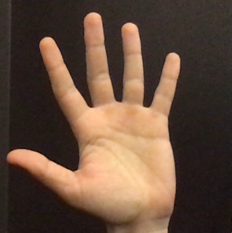
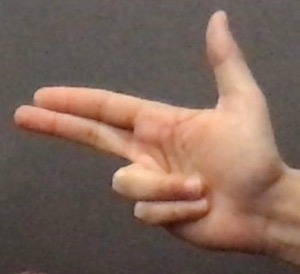
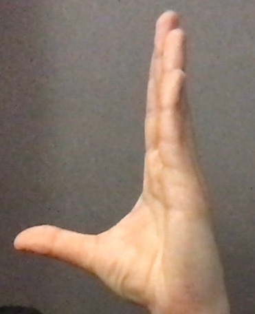
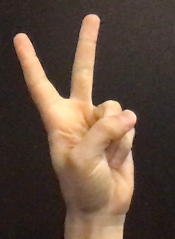
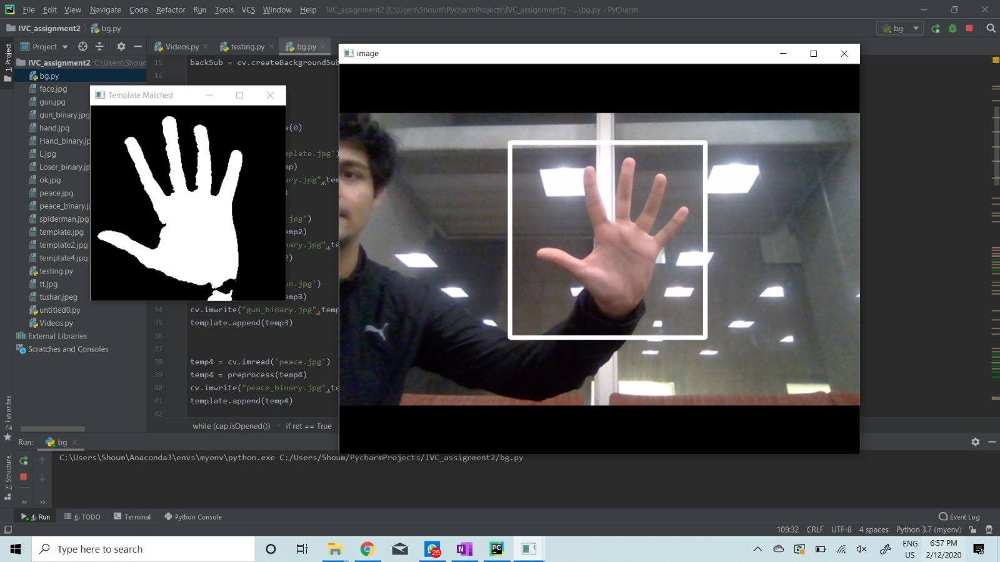
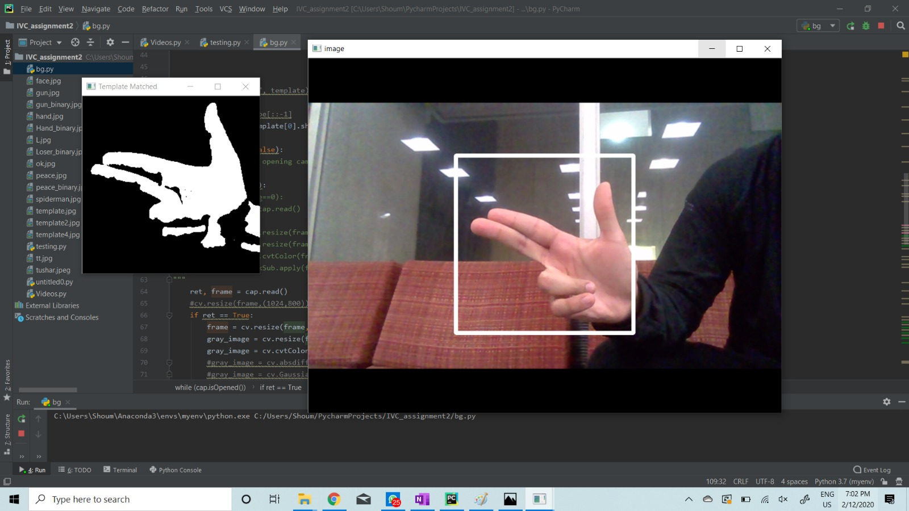
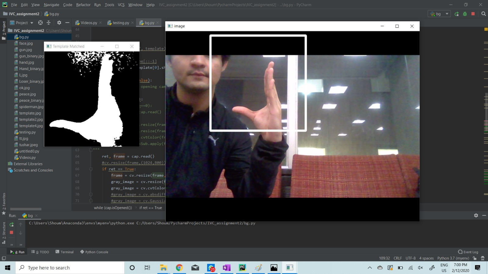
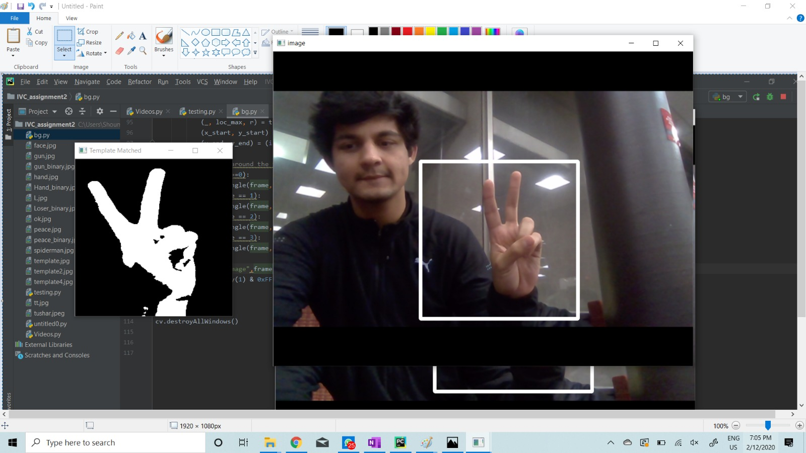

# Template-Matching-using-Cross-Correlation-OpenCV

<body style="">

 Shoumik Majumdar 
 Team-mate: Tushar Sharma 
 <!--Your teammate names if applicable  -->
Feb 12, 2020

<h2> Problem Definition </h2>

 Using Template Matching and other basic computer vision techiniques to build a program using OpenCV that can
 recongnize 4 different hand shapes in real-time. 

<h2> Method and Implementation </h2>

Steps:

<ol>
<li>Using background subtraction to make the program invariant to background noise</li>
<li>Detecting skin color by using a range of RGB values obtained through experiments </li>
<li>Using thresholding to binarize the image for detected skin pixels</li>
<li>Applied the same set of transformations to the template image</li>
<li>A range of scaling factors is used to scale the set of template images and it's compared with the source frame</li>
<li>The template with the highest NCC with the scene is reported</li>

Following OpenCV methods were used:
<ul>
<li>minMaxLoc: to find the maximum value (and its index)of a matrix </li>
<li>threshold: to binarize an image with a given threshold</li>
<li>rectangle, putText: to draw bounding box over the detected gesture</li>
<li>matchTemplate: to calculate the cross-correlation of two images</li>
</ul>

<h2>Experiments</h2>

These are the four different templates used: 

<table border=1>
<tr><th>Name</th><th>Template</th></tr>
<tr><td>Palm</td><td>
<tr><td>Gun</td><td>
<tr><td>L</td><td>
<tr><td>Peace</td><td>
</table>

<h2> Results</h2>

Here are several recognition results of all four hand shapes:

<table border="1">
<tr><th>Hand Shape Name</th><th>Result</th></tr>
<tr><td>Palm</td><td></td></tr>
<tr><td>Gun</td><td></td></tr>
<tr><td>L</td><td></td></tr>
<tr><td>Peace</td><td></td></tr>
</table>

The following confusion matrix was obtained by changing the hand gestures 

<table border="1">
<tr><th>Hand Shape</th><th>Palm</th><th>Gun</th><th>L</th><th>Peace</th></tr>
<tr><th>Palm</th><td>6</td><td>0</td><td>0</td><td>1</td></tr>
<tr><th>Gun</th><td>0</td><td>6</td><td>0</td><td>0</td></tr>
<tr><th>L</th><td>0</td><td>2</td><td>5</td><td>2</td></tr>
<tr><th>Peace</th><td>2</td><td>0</td><td>1</td><td>5</td></tr>
<table>

<h2> Discussion </h2>

<ul>
<li>As per our experiments, better accuracy was obtained when the background was plain.</li>
<li>Similar gestures like peace and palm were mistakenly recognized sometimes.</li>
<li>Rather than looping through different scaling factors for matching the template, we can extract the area of the palm and scale the template accordingly to make the program run much faster.</li>

</ul>

<h2> Conclusions </h2>

Based on the discussion, we concluded that background subtraction is a powerful technique for isolating hand-motion and when coupled with thresholding, it becomes a useful tool for recognising different hand-gestures.

<h2> Credits and Bibliography </h2>

https://docs.opencv.org/3.4/d1/dc5/tutorial_background_subtraction.html

</body></html>
